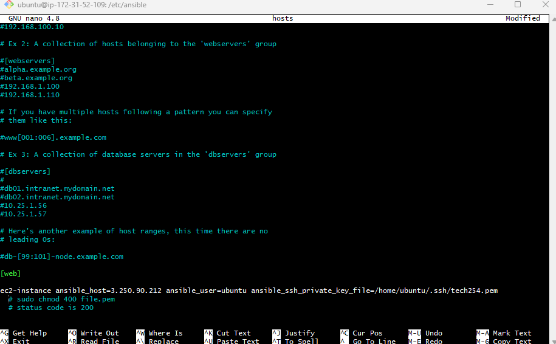
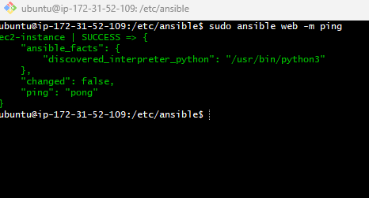
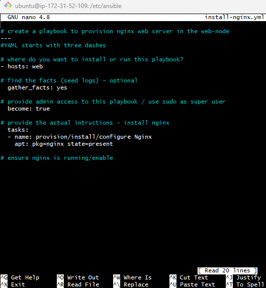
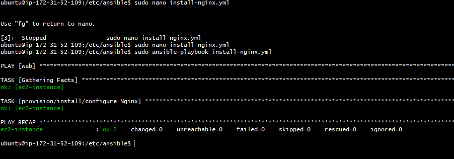
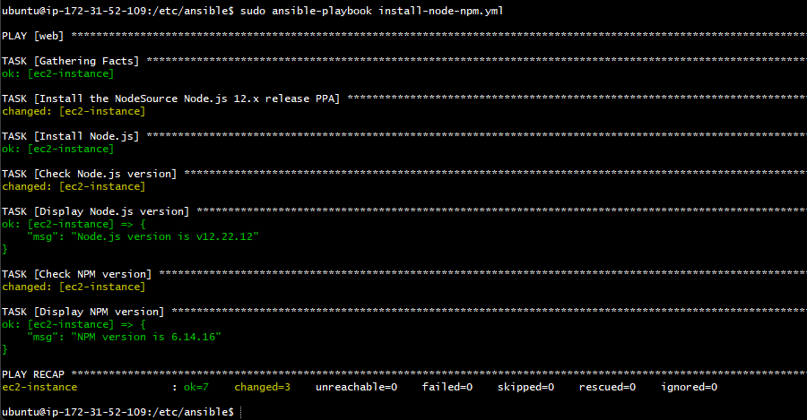
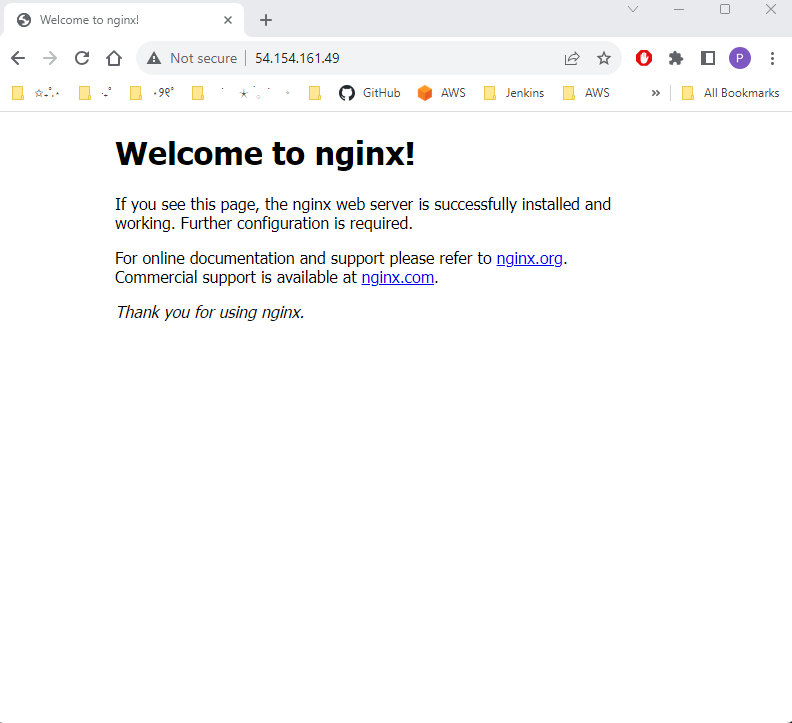

# Ansible Playbook & Ad-Hoc Commands

### Ansible Playbook

Ansible playbooks are a key component of Ansible. Playbooks are written in YAML format, which is human-readable and easy to understand.

- Playbooks are a set of instructions written in YAML that specify the steps and tasks Ansible should execute on target hosts. 

-  It connects from the control node, any machine with Ansible installed, to the managed nodes(target instances) sending commands and instructions to them.

### Ad-hoc Commands 

Ad-hoc commands are used to perform simple tasks without the need to create a playbook. These are one-off commands used for quick tasks or checks. 

For instance, if you want to quickly check if your web servers are up and running, you might use an ad-hoc command:

- 'ansible' - Invokes the Ansible command-line interface.
- 'web' - specifies the target host. 
- '-m '- indicates the module to use.
   
```bash
sudo ansible web -m ping
```

## Configuring host and Creating Ansible Playbook on our Controller

   ### Set up your Ansible Controller

- Create three EC2 instances one for our **Ansible controller**, one for ansible-app and one for ansible-db.  SSH into our Ansible controller from our Gitbash terminal. 
  
- Install Ansible dependicies to set up Ansible controller : 

     ```bash
        sudo apt update 

        sudo apt upgrade 

     #Installs the software-properties-common package
        sudo apt install software-properties-common

        #This command adds the Ansible PPA repository to your system
        sudo apt-add-repository ppa:ansible/ansible

        #Updates the package lists
        sudo apt update -y

        #Installs Ansible, an automation tool for configuration management.
        sudo apt install ansible -y

        #change directory to .ssh
        cd ~/.ssh
        ```
- Open another gitbash terminal (localhost) > cd into .ssh and copy your pem key to your ansible controller by running this command: 

    ```
    scp -i "~/.ssh/tech254.pem" ~/.ssh/tech254.pem ubuntu@[ipaddress]:~/.ssh
    ```
- Go back to your controller, and cd into .ssh folder. Make sure the key has been copied over. Followed by adjusting permission of the pem file by running the following command:

    ```
    sudo chmod 400 tech254.pem 
    ```

### Adding Target Host to Ansible Inventory

- On your controller, change directory to ansible inventory. This directory is where ansible's configuration files are typically stored.
  
    ```
    cd /etc/ansible 
    ```

- Once you're in this directory, you can edit the hosts file to add your target hosts. This file is where you define the groups of hosts that Ansible can manage. To edit the hosts file, run the following command:
  
  ```
  sudo nano hosts
  ```

  Output: 

  

- I have added my ec2 instance (ansible- app) to the hosts file, This includes the IP address of the EC2 instance, I have specified the username that ansible will use to connect (ubuntu) and finally I have added the file path to the private key file (.pem) that Ansible will use to authenticate with the remote host.

    ```bash
    [web]
    ec2-instance-app ansible_host=3.250.90.212 ansible_user=ubuntu ansible_ssh_private_key_file=/home/ubuntu/.ssh/tech254.pem

    #sudo chmod 400 file.pem
    #status code is 200
    ```

- Now ctrl + x to save and exit the file. Lets run our first Ad-hoc command. 
  
    ```
    sudo ansible web -m ping
    ```

    Output: 

    

### Creating playbook to provision Nginx server

- On the same directory, cd /etc/ansible - we will create a playbook to provision nginx server. Start by running the following command, remember to put yml at the end as playbook use YAML format. 
   
  ```
  sudo nano install-nginx.yml
  ``````

- Inside this file, we'll write the following tasks needed to install and configure Nginx.

  

- In order to run the playbook we need to run the following command: 
    ``` 
    sudo ansible-playbook install-nginx.yml
    ```

  Output: 

  

### Creating playbook to provision NodeJS

- Run the following command to create a new text file. 

    ```
    sudo nano install-node-npm.yml
    ```

- Inside this file, we'll write the following tasks needed to install and configure NodeJS.

    ```YAML
    # Create a playbook to provision NodeJS
    ---
    # where do you want to install or run this playbook
  - hosts: web

 

  # find the facts (seed logs) - optional
  gather_facts: yes

 

  # provide admin access to this playbook / use sudo as super user
  become: true

 

  # provide the actual instructions - install NodeJS
  tasks:
    - name: Install the NodeSource Node.js 12.x release PPA
      shell: "curl -sL https://deb.nodesource.com/setup_12.x | bash -"

 

    - name: Install Node.js
      apt:
        name: nodejs
        state: present

 

    - name: Check Node.js version
      shell: "node -v"
      register: node_version

 

    - name: Display Node.js version
      debug:
        msg: "Node.js version is {{ node_version.stdout }}"

 

    - name: Check NPM version
      shell: "npm -v"
      register: npm_version

 

    - name: Display NPM version
      debug:
        msg: "NPM version is {{ npm_version.stdout }}"

    ```
- In order to run the playbook we need to run the following command: 
    ``` 
    sudo ansible-playbook install-node-npm.yml
    ```
    Output: 

    

     #### Testing 
     
    