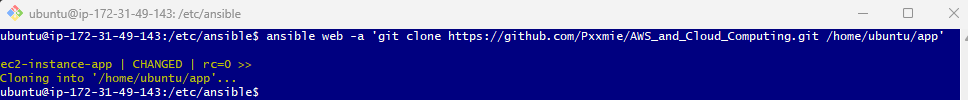

# Creating playbook for MongoDB from our Controller

After creating another instance for our Mongodb. We need to SSH into and update and upgrade. Followed by copying our pemfile from local host to our mongodb instance as we set up our app. 

### Configure host on our controller - Add mongodb into controller host 

- After our controller instance as been created and set up. Go to the following directory where we will be adding Mondogdb host: 

    ``` 
    cd /etc/ansible
    ```

- Lets go into our host file, by running the command below, you should see the hosts page and now we need to add our db ip below our app [web]

    ``` 
    sudo nano hosts
    ```

  

     ```bash
    [db]
    ec2-instance-db ansible_host=3.250.90.212 ansible_user=ubuntu ansible_ssh_private_key_file=/home/ubuntu/.ssh/tech254.pem
    ```

- After you have added your db address into the hosts, lets save and exit. 

- Run the following commands in order to ping our db instance. 
    ```
    sudo ansible db -m ping 
    ```
   Output: 

   

### Creating playbook to install Mongodb

- On the same working dir cd etc/ansible lets create another playbook and this will be run to install mongodb in our db server. 

    ```
    sudo nano install-mongodb.yml
    ```

 - Lets enter this script in our playbook in order to install mongodb: 
  
   ```bash
   ---
    # YAML starts with three dashes

    # agent node name/ip
    - hosts: db

    # gather facts
    gather_facts: yes

    # provide admin access
    become: true

    # provide instructions
    tasks:
    - name: set up mongodb in db ec2
      apt: pkg=mongodb state=present

    # ensure db is in a running state
    
   ```
- Save and exit, and run the following command to run the playbook: 

    ```
    sudo ansible-playbook install-mongodb.yml
    ```

    Output: 

    

- Finally, lets check if this mongodb is running in our db server by running the following command: 

    ```
    sudo ansible db -a "systemctl status db
    ```
    


### Creating a playbook to configure the binp ip for Mongodb

- Lets create another playbook named mongodb-config.yml
  
  ``` 
  sudo nano mongodb-config.yml
  ```

- On our yaml file, lets enter the following script: 

    ```bash        
    ---
    # This Playbook will Configure BindIP 

    # Target host -db server
    - hosts: db

    # Gather facts about the host
     gather_facts: yes

    # Become a superuser to have necessary privileges
     become: true

    # Update BindIP in the mongod.conf file
     tasks:
        - name: Update BindIP in the mongod.conf file
          replace:
            path: /etc/mongodb.conf
            regexp: 'bind_ip = 127.0.0.1'
            replace: 'bind_ip = 0.0.0.0'

    # Restart MongoDB Service
        - name: Restart MongoDB Service
          service:
           name: mongodb
           state: restarted
           enabled: yes
    ```

- Lets run our playbook:

    ```
    sudo ansible-playbook mongodb-config.yml
    ```

    Output: 
    
    

### Setting up Environment Variable 

-  Now we will set an environment variable on our app instance from our Ansible controller, you can use the shell module with the export command.

    ```bash
    ansible web -m shell -a 'export DB_HOST=mongodb://DBpublicIP:27017/posts'
    ```
    Output: 

    


### Cloning Appjs onto our app instance through controller

- In our controller run the following command : 

    ```
    ansible web -a 'git clone https://github.com/Pxxmie/AWS_and_Cloud_Computing.git /home/ubuntu/app'
    ```

   

- We can check if it has been cloned or not by going into our app instance and running 'ls' :

    

#### Running the appjs from our controller 

 Now that we have cloned the app folder onto our web server. We need to install npm and run the app.js file.  

- First we need to run this command to configure the path for the npm package manager on our web server instance.
    ```bash
    sudo ansible web -m npm -a "path=/home/ubuntu/app/app/app"
    ```

- This command installs PM2 globally on our web server, allowing you to manage Node.js applications.
    ```
    sudo ansible web -a "sudo npm install pm2 -g"
    ```
- Running this command stops all running processes managed by PM2 on our web server.
    ```
    sudo ansible web -a "sudo pm2 kill"
    ```
- Finally, this command starts our Node.js application using PM2.
    ```
    sudo ansible web -a "pm2 start /home/ubuntu/app/app/app/app.js"
    ```

    Output: 

    

    #### Testing

    