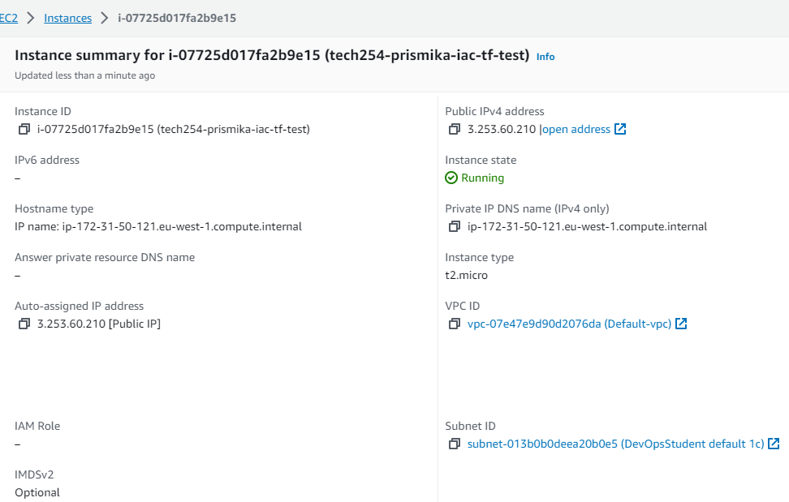

# Creating an EC2 Instance using Terraform

### Step 1: Download Terraform 

  - Go to the official Terraform download page -  [Terraform Download Link](https://developer.hashicorp.com/terraform/downloads?product_intent=terraform)
  
    

- Once the ZIP file is downloaded, locate it and extract its contents to a directory of your choice, I have saved it on my C drive. 

    

### Step 2: Set up Envrionment Variables

- Click on the Windows Start menu and type **Environment Variables**. Select **Edit the system environment variables** and in the System Properties window, click the **Environment Variables...** button.

   

- In the Environment Variables window, under the **User variables** section, click **New**. Enter Variable Name and Value. For Variable name, enter **AWS_ACCESS_KEY_ID** and **AWS_SECRET_ACCESS_KEY** . Remember to press ok after you filled one before creating another one.
  
  

### Step 3: Using Terraform

Once you have Terraform installed and configured, open GitBash.

- You can check the version of your Terrform by running: 
   
   ```bash
   Terrafrom --version
   ```

   


- Now we can make our first Terraform project, I have created a new directory by running the following command. 

    ```bash
    mkdir tech254-terraform
     ```
     

    
- After you cd into your directory you have made, I now created a terraform configuration file in order to write my first script/configuration. 

    ```
    nano main.tf
    ```
  
- First we have written a terraform configuration code to set up an AWS provider and specifying the region as "eu-west-1". We are using AWS as our cloud provider, and we're specifying the EU (Ireland) region as our target location.

   ```bash
   # Who is the cloud provider?
    provider "aws" {

    # location of aws
     region = "eu-west-1"

    }
    # to download required dependencies
    # create a service/resource on the cloud - ec2 on AWS
   
   ```

- Save and exit the file and run the following command in order for Terraform to download the necessary providers and modules defined in our configuration.

    ```
      terraform init
    ```

    

- Now lets go back into our configuration file, in order to define the resources and configurations for our infrastructure so we can provision an EC2 instance.

    


- Save and exit your file. Running this following command will display a summary of the proposed changes, including any resources that will be added, changed, or removed. 

    ```
    terraform plan
    ```
    output:

    

- Finally, in order to apply our changes we use the following command and this applies the changes specified in our configuration files to our infrastructure. 

    ```
    terrform apply
    ```

    output: 

    


   ### Testing
   
   

   


-  Finally, in order to terminate our instances, we can run the following command from our terminal 

    ```bash
    terraform destroy
    ```

    Output: 

    